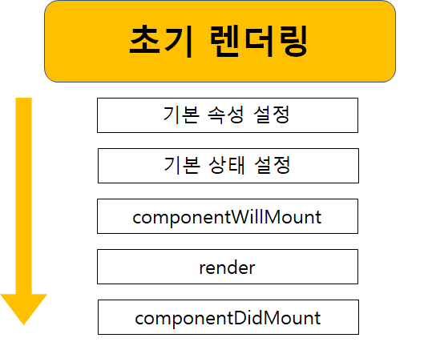

# Life Cycle

`Life Cycle`이란 `Component`의 일생에서 다양한 시점에 호출되는 이벤트 헨들러라고 생각하면 된다.

## First State

`Component`가 생성되고 `DOM`이 만들어지는 과정 중에는 다음과 같이 생명주기 메소드들이 호출된다.



**기본 속성 설정**
`Component`의 `defaultProps` 속성은 `this.props`의 기본 값을 지정할 수 있게 해준다.

`component`가 생성되기 전이나 부모로부터 속성이 전달될 때 실행된다.

**기본 상태 설정**
이 단계는 컴포넌트의 생성자 안에서 진행된다.

```js
constructor(props){
  super(props);

  this.state = {
    count : 0
  };
};
```

**componentWillMount**
`Component`가 DOM 안으로 렌더링되기 전에 호출되는 마지막 메소드이다.

이 메소드 안에서는 `setState`를 호출해도 `Component`가 다시 렌더링 되지 않는다.

**render**
모든 `Component`에 정의되어 있어야 하는 메소드이며, JSX를 `return`한다.

`rendering`이 필요없다면 단순히 `null`이나 `false`를 `return`하면 된다.

**componentDidMount**
`component`가 `rendering` 되어 `DOM`에 자리 잡은 직후 호출된다.

모든 준비를 마친 `Component`에만 의존하는 코드를 지정하면 된다.

render 메소드를 제외하면 지금까지의 모든 생명주기 메소드들은 한번만 실행된다.

---

## 수정

**componentDidUpdate**
이 메소드는 component가 update되고 render 메소드의 실행이 끝난 후에 호출된다.

update 후에 수행하고 싶은 코드가 있다면 적합한 위치이다.
